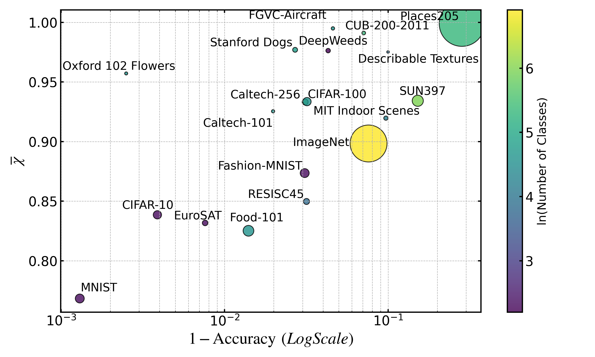

# Class-wise Autoencoders Measure Classification Difficulty and Detect Label Mistakes


[Jacob Marks](https://github.com/jacobmarks)\* $^1$, [Brent A. Griffin](https://github.com/griffbr)$^1$, [Jason J. Corso](https://github.com/jasoncorso)$^{1,2}$ 


$\quad \quad$ $^1$[Voxel51](https://voxel51.com) $\quad$ $^2$[University of Michigan](https://web.eecs.umich.edu/~jjcorso/)

\* Corresponding author


<figure>
  
    <figcaption>Dataset difficulty scores for 19 common computer vision datasets. The scores are computed using the RER framework, which measures the difficulty of classifying each sample in the dataset.
    </figcaption>
</figure>


This repository contains the code for the paper *Class-wise Autoencoders Measure Classification Difficulty and Detect Label Mistakes*.

Reconstruction Error Ratios (RERs) provide a simple, fast, and flexible framework for analyzing visual classification datasets at the sample, class, and entire dataset level. 

RERs allow you to estimate the difficulty of classification for a given dataset. They can also be used to detect potential label mistakes in the dataset, by reinterpreting the RERs as a measure of mistakenness.

This repo contains the code to compute RERs on your dataset and reproduce the experiments in the paper.


## Installation

First, clone the repository:

```bash
git clone https://github.com/voxel51/reconstruction-error-ratios.git
```

Then, install the dependencies:

```bash
cd reconstruction-error-ratios
pip install -r requirements.txt
```

To reproduce the experiments in the paper, you will also need to install the Weights and Biases Python client:

```bash
pip install wandb
```

Additionally, to generate confidence-based noise, you will need  `ultralytics>=0.8.0` and `fiftyone>=0.25.0`. You can install these with:

```bash
pip install ultralytics>=0.8.0 fiftyone>=0.25.0
```


## Usage

### Data Preparation
The RER computation script in this repo assumes that your dataset is stored as a FiftyOne dataset, with ground truth classification labels (of type `fo.Classification`) in the `ground_truth` field. If your dataset is not in this format, you will need to convert it to a FiftyOne dataset first.

If your dataset is in an image classification directory structure like

```bash
dataset/
    class1/
        image1.jpg
        image2.jpg
        ...
    class2/
        image1.jpg
        image2.jpg
        ...
    ...
```

then you can run the following command, replacing `\path\to\dataset` with the path to the dataset directory and `my_dataset` with the name of the dataset to be created:

```bash
python data_preparation_scripts/prepare_from_directory.py --data_dir '\path\to\dataset' --dataset_name my_dataset
```

This will create a Fiftyone dataset named `my_dataset`, which you can load and visualize in the Fiftyone App with:

```python
import fiftyone as fo
dataset = fo.load_dataset("my_dataset")
session = fo.launch_app(dataset)
```

### RER Computation

To compute the RERs for the dataset, run:

```bash
python run.py --dataset_name my_dataset
```

When you run this command, the script will print out an estimate for the time it will take to compute the RERs for the dataset. Upon completion, estimates for the dataset difficulty and noise rate will be printed out to the console. Additionally, they will be stored in a [custom run](https://docs.voxel51.com/plugins/developing_plugins.html#storing-custom-runs), whose name will be printed out to the console. You can access the run and all of its data via

```python
import fiftyone as fo
dataset = fo.load_dataset("my_dataset")
results = dataset.load_run_results("my_run")
```

In these dataset-level results, `chi_avg` ($\overline{\chi}) is the raw dataset difficulty score, which can be directly compared with the values presented in the paper. On the other hand, `classification_difficulty` is a normalized dataset difficulty score between zero and one, with zero being roughly MNIST-level difficulty and one being roughly the most difficult datasets in the paper. `noise_rate` is the estimated noise rate in the dataset, encapsulating both label noise and other sources of noise in the dataset.

### Mistakenness Detection
If you refresh the FiftyOne App after running the RER computation script, you will then see the mistakenness score for each sample stored in the `mistakenness` field of the dataset, as well as a boolean `mistake` field indicating whether the sample is a potential label mistake. This boolean is determined using the automated threshold ansatz described in the paper, but you can designate your own criteria for what constitutes a mistake. The threshold is stored in `threshold` in the run results object.

You can filter the dataset to only show the potential label mistakes with:

```python
from fiftyone import ViewField as F
mistake_view = dataset.match(F("mistake") == True)
session.view = mistake_view
```

You can sort by the mistakenness score with:

```python
sorted_view = mistake_view.sort_by("mistakenness", reverse=True)
session.view = sorted_view
```

where `reverse=True` will sort in descending order, or `reverse=False` will sort in ascending order.

You can extract the mistakenness values for the dataset with:

```python
import numpy as np
mistakenness = np.array(dataset.values("mistakenness"))
```

### Class-Level Difficulty Scores

Average difficulty scores for each class are stored in `results.class_chis`.

```python
class_chis = results.class_chis

# Print the class-wise difficulty scores
for class_name, chi in class_chis.items():
    print(f"{class_name}: {chi}")
```

### Mistakenness Probabilities

As detailed in Appendix D of the paper, we can use the RERs, the reconstruction error matrix, and our estimated noise rate for the dataset to approximately assign a mistakenness probability to each sample. This comes at a cost of increased computational complexity, but can be useful for certain applications. To compute these mistakenness probabilities, just add the `--compute_mistakenness_probs` flag to the `run.py` script:

```bash
python run.py --dataset_name my_dataset --estimate_probs
```


## Reproducing Experiments

### Downloading and Preparing the Data

To reproduce the experiments in the paper with CLIP ViT-L/14 features, you can download and prepare the relevant datasets using the script `data_preparation_scripts/download_and_prepare_dataset.py`. This script provides a download function for 18 of the 19 datasets used in the main text (all except ImageNet), as well as the 10 medical datasets in MedMNISTv2.

For RESISC45 and MedMNISTv2, you will need to have the `huggingface_hub` Python package installed. You can install this with:

```bash
pip install huggingface_hub
```


To download and prepare all (non-ImageNet) datasets, you can run:

```bash
python data_preparation_scripts/download_and_prepare_dataset.py
```

For each dataset, this script downloads the media files, formats labels, creates the FiftyOne dataset, randomly splits the dataset into train and test sets, and generates feature embeddings with CLIP ViT-L/14.

If you just want to download and prepare a single dataset, you can pass the `--dataset_name` argument to the script. For example, to download and prepare CIFAR-10, you can run:

```bash
python data_preparation_scripts/download_and_prepare_dataset.py --dataset_name cifar10
```

💡 The names of all datasets that work with this command are included at the top of the script `data_preparation_scripts/download_and_prepare_dataset.py`.

For ImageNet, we suggest that you download and format the dataset in `ImageClassificationDirectoryTree` format, and then run the `prepare_from_directory.py` script as described above.

### Noise Generation

The mislabel detection experiments require that noise is added to the dataset so that the performance of the mislabel detection methods can be evaluated. Noise comes in four varieties:

- Symmetric (`symmetric`): With probability $\eta$, a label $c_i$ is swapped uniformly where a label $c_j$, with $i\neq j$.

- Asymmetric (`asymmetric`): With probability $\eta$, label $c_i$ is changed to $c_{i+1}$ modulo the number of classes.

- Confidence-Based (`confidence`): A classifier is trained on the clean labels and used to run inference on the samples. For a given sample with label $c_i$, with probability $\eta$ the label is changed to the highest likelihood incorrect label predicted by the classifier for that sample.

- Human Annotator-Based (`human`): A single human annotator assigns a label to each sample. This label is mistaken when it is in disagreement with the ground truth label resulting from aggregation and validation of human annotations. Mistakes from this set are randomly selected until $\eta$ (which must be less than or equal to the fraction of human annotator errors in the entire dataset) of the samples are assigned mistaken labels.

The script `data_preparation_scripts/noise.py` provides a common interface for generating the first three varieties of noise. You can specify the `dataset_name`, the type of noise to be generated, what fractions of noise to add (will run the script once for each fraction), and the seed for reproducibility. For example, to generate symmetric noise with a noise rates of $0.1$ and $0.2$ for CIFAR-10, you can run:

```bash
python data_preparation_scripts/noise.py --dataset_name cifar10 --noise_type symmetric --noise_rate 0.1 --seed 51
```

Confidence-based noise permits a few additional command-line arguments. This implementation of the codebase uses YOLOv8 models, for which you can specify the model size (`conf_model_size`), input image size (`conf_img_size`), and number of epochs (`conf_epochs`). For example, to generate confidence-based noise with a noise rate of $0.1$ for CIFAR-10, you can run:

```bash
python data_preparation_scripts/noise.py --dataset_name cifar10 --noise_type confidence --noise_rate 0.1 --seed 51 --conf_model_size m --conf_img_size 640 --conf_epochs 10
```

Human annotator-based noise settings are only available for CIFAR-10 and CIFAR-100, and must be downloaded from [https://github.com/UCSC-REAL/cifar-10-100n](https://github.com/UCSC-REAL/cifar-10-100n) with the script `data_preparation_scripts/download_cifar_human_noise.py`. This script downloads the human annotator-based noise settings for CIFAR-10 and CIFAR-100. You can run this script with:

```bash
python data_preparation_scripts/download_cifar_human_noise.py
```

to download the human annotator-based noise settings for CIFAR-10 and CIFAR-100. Once these have been downloaded, you can use these to generate human annotator-based noise with the script `data_preparation_scripts/noise.py`, for noise rates up to the fraction of human annotator errors in the dataset. For example, to generate human annotator-based noise with a noise rate of $0.1$ for CIFAR-10, you can run:

```bash
python data_preparation_scripts/noise.py --dataset_name cifar10 --noise_type human --noise_rate 0.1 --seed 51
```

### Running Experiments

The `test_methods.py` script is the main script for reproducing the experiments in the paper. This script supports running four methods for mislabel detection:
- Reconstruction Error Ratios (RERs)
- Confident Learning (CL)
- SimiFeat
- Zero-shot Mislabel Detection

Additionally, it supports estimating dataset-level difficulty using RERs. Check out the script for more details on how to run the experiments and the available command-line arguments.

For ease of reproducibility, we provide scripts for running each of the main experiments in our paper in the `experiment_scripts` directory. These scripts can be easily modified to run on your own datasets and with your own settings.

### Debugging and Troubleshooting

If you encounter any issues with the codebase, please feel free to open an issue on this repository. We will do our best to address the issue as soon as possible.

Before reaching out, you may want to try the following:

- **Embeddings**: If embeddings are not being generated, ensure that you are on a CUDA-compatible machine and that you have the necessary dependencies installed. Additionally, just because you have downloaded and prepared the dataset with CLIP ViT-L/14 embeddings does not mean that ALL embeddings have been computed. All feature embeddings are not computed by default to save time and space. The `data_preparation_scripts/generate_embeddings.py` script can be used to generate embeddings with a specified model. When you want to run experiments with these features, you need to specify this with the `--features` argument in the `test_methods.py` script.
- **Mislabel Detection**: If you are running mislabel detection experiments at a certain noise rate and with a certain seed, ensure that you have generated the noise for the dataset with the same noise rate and seed. Files for the noise generation are stored in the `data` directory.
- **ParametricUMAP Crashing**: If the RER computation is crashing and/or not converging, it is likely due to numerical instabilities in the `a` and `b` UMAP parameters. These are set negative by default, which gives best results for dataset difficulty estimation, but can cause issues on some computers. If you are experiencing isues (and you are primarily concerned with mislabel detection), try setting these to positive values. Note that you will need to use the `test_methods.py` script to do this, as the `run.py` script does not support this functionality.
- **Memory Issues and Hanging Jobs**: When working with large datasets like Places and ImageNet — and especially large datasets that have a large number of classes (like ImageNet), you may run into memory issues, which can cause the job to hang. This is in large part a limitation of the current implementation of the codebase. If this happens, try reducing the number of workers if you're running in parallel, or try running on a machine with more memory. If you're interested in helping us improve the codebase, please reach out!


## 📚 Citation

If you find this code useful, please consider citing our paper:

```bibtex
@article{marks2024classwise,
  title={Class-wise Autoencoders Measure Classification Difficulty and Detect Label Mistakes},
  author={Marks, Jacob and Griffin, Brent A and Corso, Jason J},
  journal={arXiv preprint arXiv:...},
  year={2024}
}
```

You may also want to check out our open-source toolkit, [FiftyOne](https://voxel51.com/fiftyone), which provides a powerful interface for exploring, analyzing, and visualizing datasets for computer vision and machine learning.